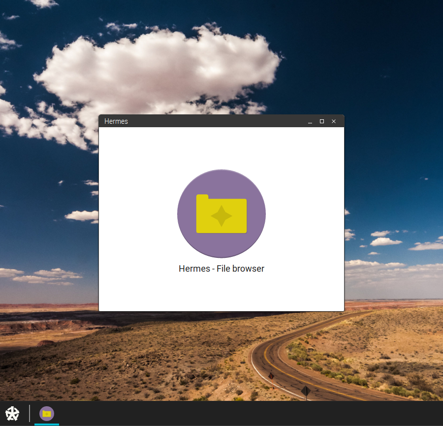

# OmphalOS
JavaScript based operating system

This project is in very early development, and isn't functional yet.


### The features so far

- TTY emulator, switch with Ctrl+Alt+[1-7]
    - TTYs don't run a shell, and so can't be used to issue commands
    - TTYs compartmentalization is currently compromized, as the XTechne panels appear on all of them. This is due to a positioning issue, which could be solved easily but would cause other problems down the road...
- Kernel level logging, exceptions and, occasionaly, kernel panic
    - Kernel-level function write() handles color codes with the syntax:<br />
    `%(F:1)Some red text%(F), %(B:4)and some blue background text%(B)`
- Draft of a display service (XTechne) and login manager (XTechneLogin)
    - The login manager checks credentials against SHA3 hashes (`/etc/passwd`)
    - The main desktop contains for now:
        - Configurable panels and panel items via `/etc/xtechne/desktoprc`
        - Draft start menu (not functional)
        - Hermes file browser (Window app template)
        - Draggable, minimizable, maximizable and closable windows
        - Not resizable yet...
    - Nomos: draft window app framework



### Installation

It's not really worth installing right now, but if you want to try it anyway, knock yourself out!

``` shell
git clone https://github.com/Schlipak/OmphalOS
npm install
npm start
```

The application will start on `localhost:3333`
